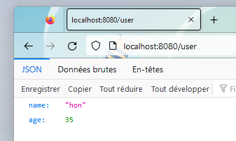
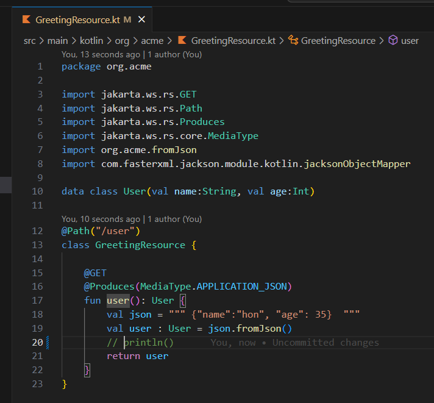
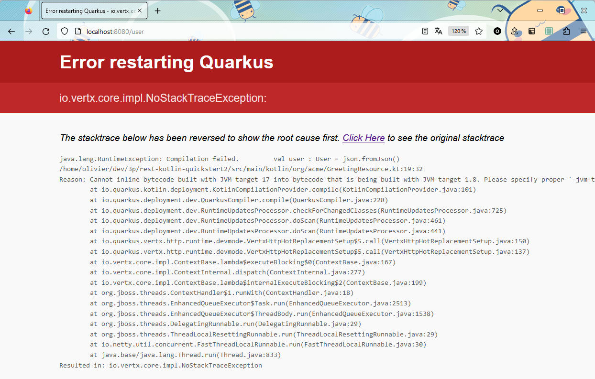
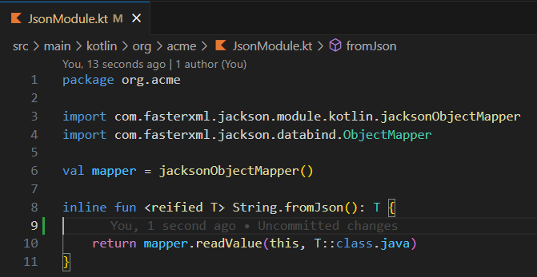

# The bug

1. start the app with `mvn clean quarkus:dev`
2. visit `http://localhost:8080/user` with your browser, it should work :blush:

   

3. edit the code by commenting something harmless (like the `println`) in the `GreetingResource.kt`

   

4. visit `http://localhost:8080/user` again with your browser, it should crash :confused:

   

5. Edit the `JsonModule.kt` with something harmless (like adding a new line), it should start :open_mouth:

   

   